# 🎭 Theatre Information System

Веб-система управления театром.
Позволяет управлять спектаклями, показами, пользователями и просматривать статистику работы театра.

Backend реализован на **Java + Spring Boot**, интерфейс — **Thymeleaf**.

---

# 📑 Содержание

* [О проекте](#о-проекте)
* [Функциональность](#функциональность)
* [Интерфейс системы](#интерфейс-системы)
* [Архитектура](#архитектура)
* [Технологии](#технологии)
* [Структура проекта](#структура-проекта)
* [Запуск проекта](#запуск-проекта)

---

# О проекте

Система предназначена для управления информацией о театре:

* спектакли
* показы
* пользователи
* статистика

Реализована ролевая модель доступа:

| Роль  | Возможности                                             |
| ----- | ------------------------------------------------------- |
| USER  | просмотр спектаклей, статистики, редактирование профиля |
| ADMIN | управление спектаклями, показами и пользователями       |
| OWNER | управление администраторами                             |

---

# 🚀 Функциональность

Система предоставляет следующие возможности:

### Пользователям

* просмотр спектаклей
* просмотр показов
* просмотр статистики
* редактирование профиля

### Администратору

* управление спектаклями
* управление показами
* управление пользователями
* просмотр статистики

### Системные возможности

* фильтрация
* сортировка
* пагинация
* REST API
* обработка ошибок
* ролевая безопасность

---

# 🖥 Интерфейс системы

## Страница входа

<p align="center">

</p>

<p align="center"><b>Рис.1 — Страница входа в систему</b></p>

---

## Страница регистрации

<p align="center">
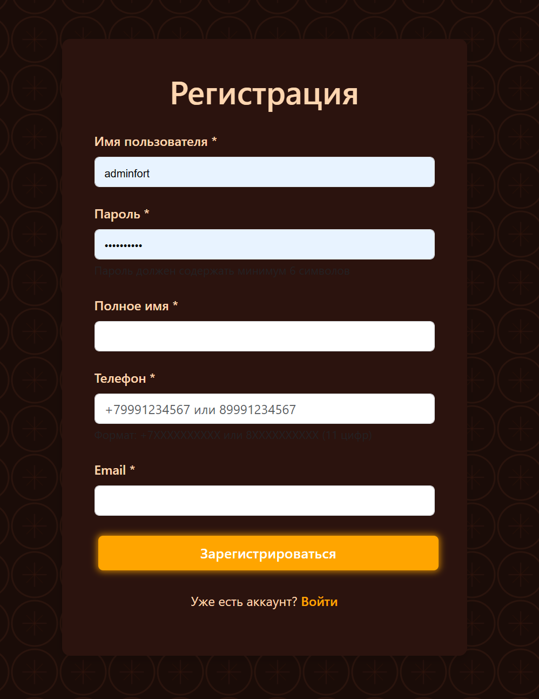
</p>

<p align="center"><b>Рис.2 — Страница регистрации </b></p>

<p align="center">
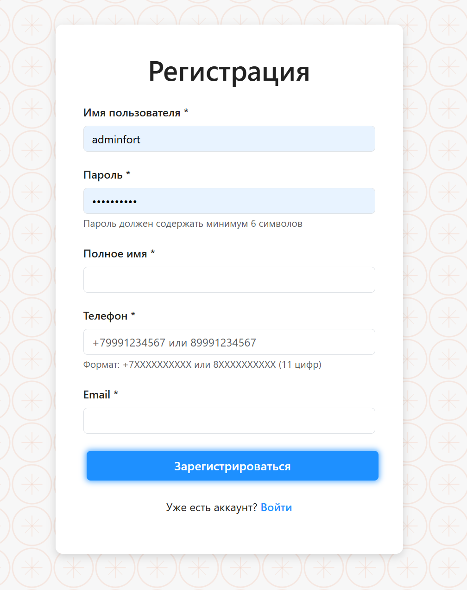
</p>

<p align="center"><b>Рис.3 — Страница регистрации светлая тема </b></p>

---

## Главная страница со спектаклями

<p align="center">
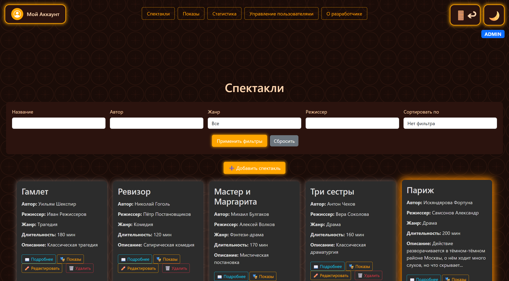
</p>

<p align="center"><b>Рис.4 — Главная страница системы</b></p>

---

## Карточка спектакля

<p align="center">
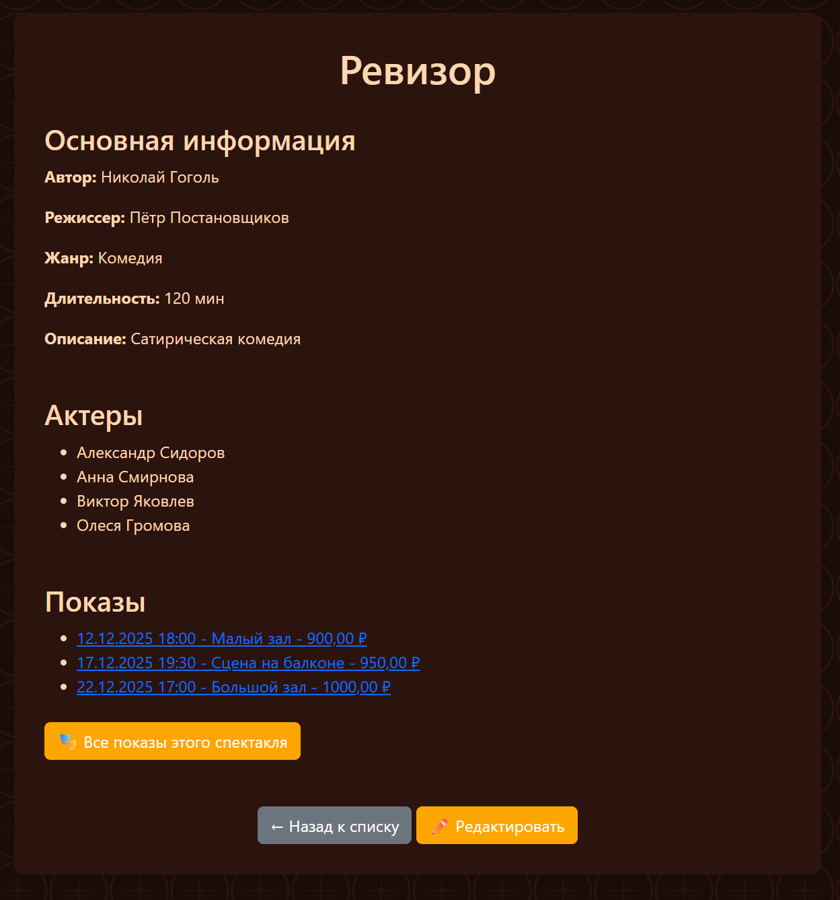
</p>

<p align="center"><b>Рис.5 — Информация о спектакле</b></p>

<p align="center">
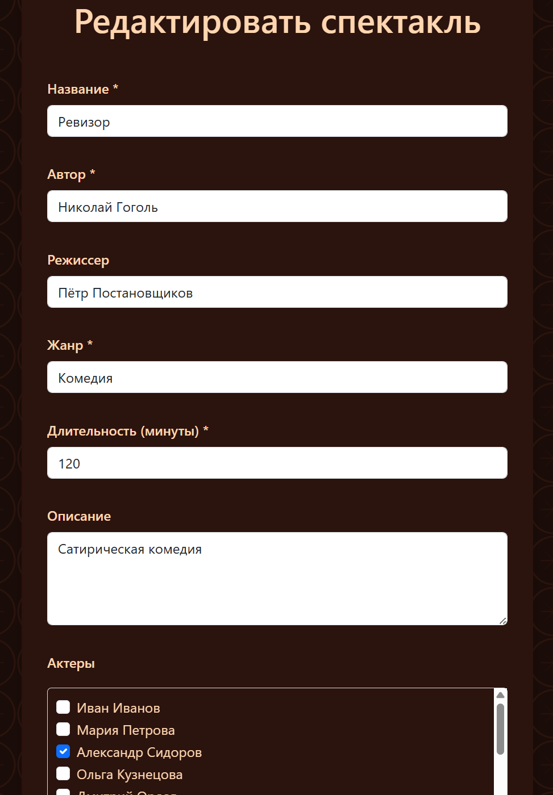
</p>

<p align="center"><b>Рис.6 — Редактирование спектакля (ADMIN)</b></p>

---
## Список показов

<p align="center">
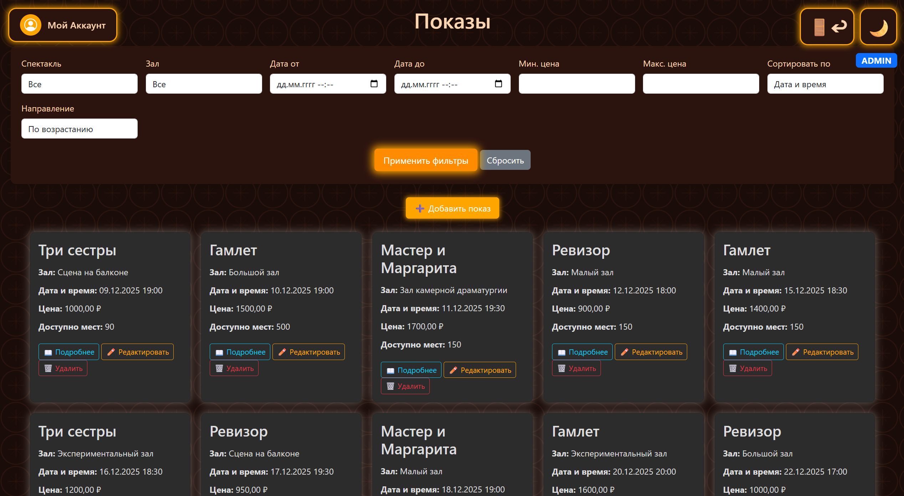
</p>

<p align="center"><b>Рис.7 — Список показов</b></p>

---

## Карточка показа

<p align="center">
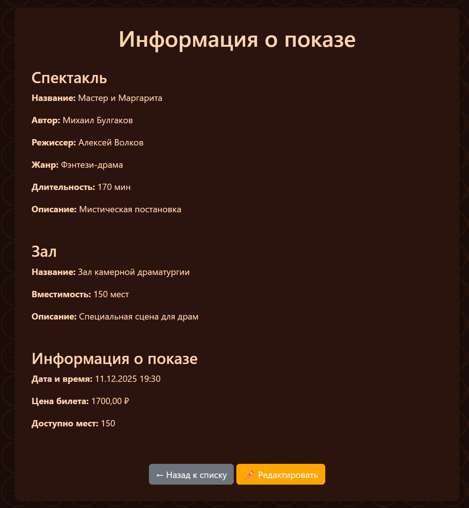
</p>

<p align="center"><b>Рис.8 — Информация о показе</b></p>

<p align="center">
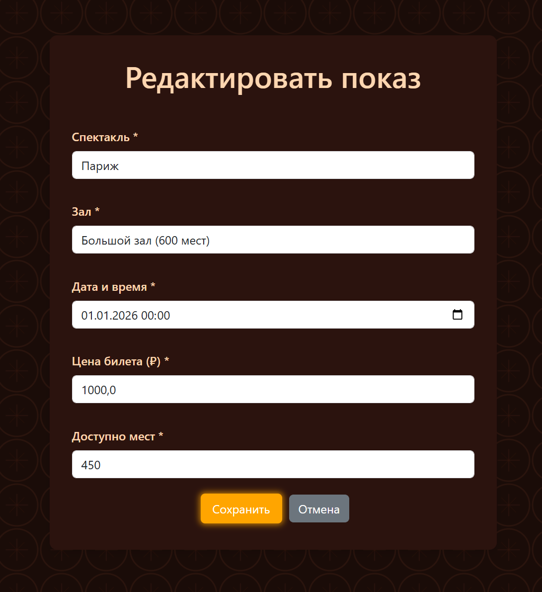
</p>

<p align="center"><b>Рис.9 — Редактирование показа (ADMIN)</b></p>

---

## Личный кабинет пользователя

<p align="center">
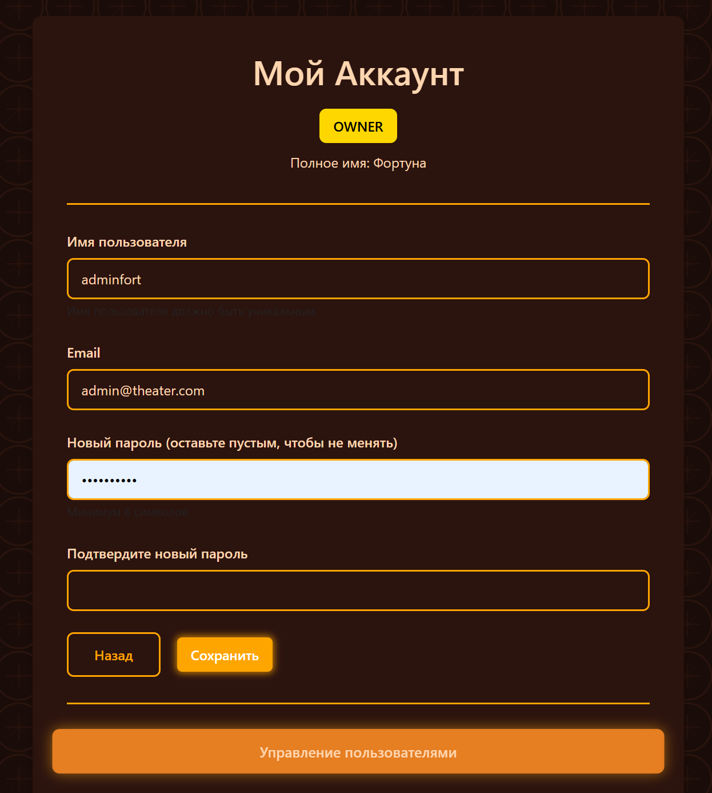
</p>

<p align="center"><b>Рис.10 — Личный кабинет пользователя</b></p>

---

## Управление пользователями

<p align="center">
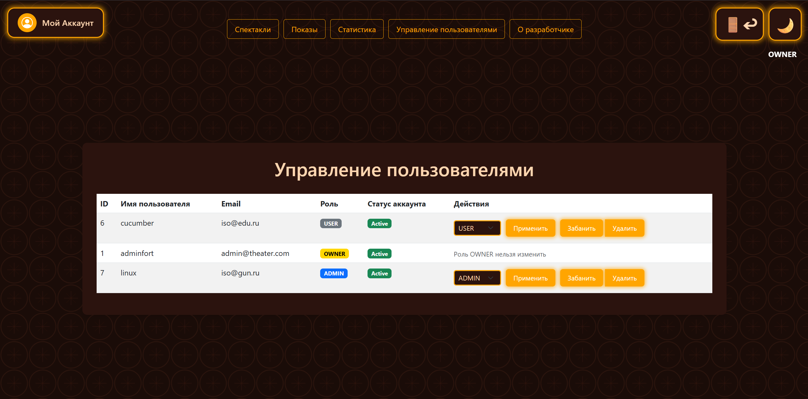
</p>

<p align="center"><b>Рис.11 — Панель управления пользователями (ADMIN)</b></p>

---

## Страница статистики

<p align="center">
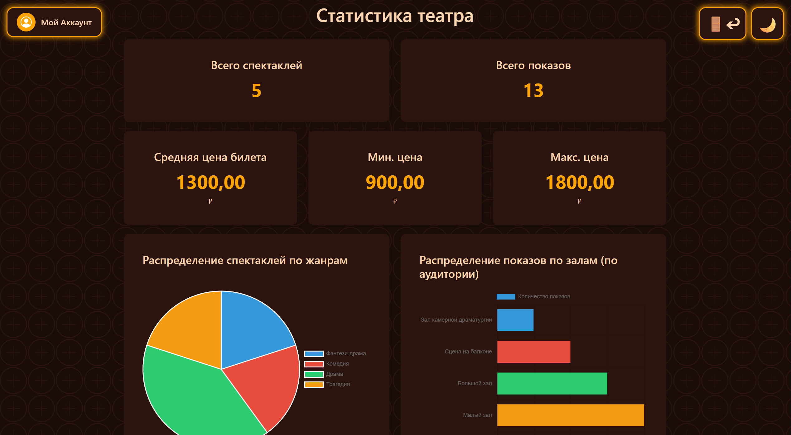
</p>

<p align="center"><b>Рис.12 — Страница статистики</b></p>

---
## Страница о разработчике

<p align="center">
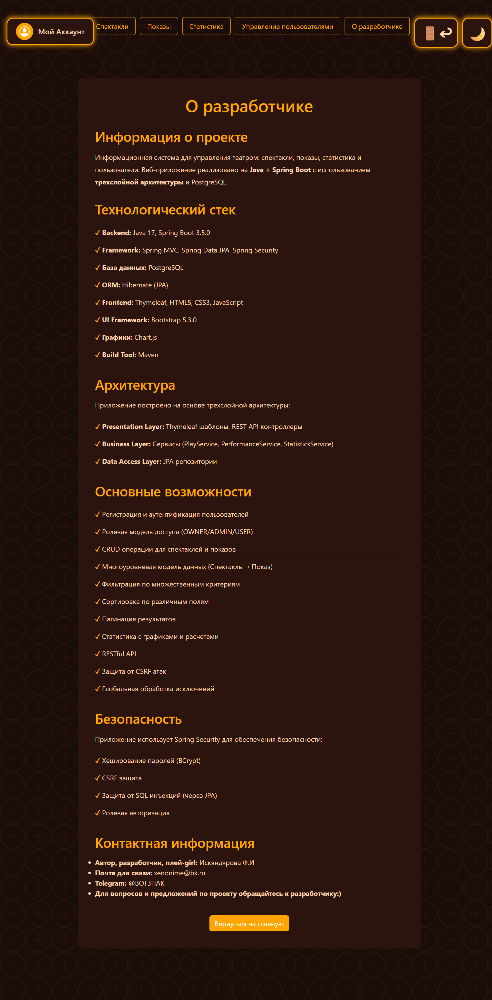
</p>

<p align="center"><b>Рис.13 — Страница о разработчике</b></p>

---

# 🧱 Архитектура

Проект реализован с использованием **трехслойной архитектуры**:

```
Presentation Layer
↓
Business Layer
↓
Data Access Layer
```

### Presentation Layer

* MVC Controllers
* REST Controllers
* Thymeleaf Templates

### Business Layer

Содержит бизнес-логику приложения:

* PlayService
* PerformanceService
* TicketService
* StatisticsService
* UserService

### Data Access Layer

Работа с базой данных через Spring Data JPA:

* PlayRepository
* PerformanceRepository
* TicketRepository
* HallRepository
* ActorRepository
* UserRepository

---

# 🗄 Модель данных

Основная структура данных:

```
Play (Спектакль)
  └── Performance (Показ)
        └── Ticket (Билет)
```

Дополнительные сущности:

* User
* Hall
* Actor

SQL схема базы данных находится в:

```
database_schema.sql
```

---

# 🔐 Безопасность

Реализована через **Spring Security**:

* аутентификация пользователей
* ролевая авторизация
* BCrypt хеширование паролей
* CSRF защита
* защита от SQL-инъекций через JPA

---

# ⚙️ Технологии

### Backend

* Java
* Spring Boot
* Spring MVC
* Spring Security
* Spring Data JPA
* Maven

### Frontend

* Thymeleaf
* HTML
* CSS

### Database

* PostgreSQL

---

# 📂 Структура проекта

```
src/main/java/com/example/theater

config
controller
dto
exception
model
repository
service
util
```

---

# ▶️ Запуск проекта

### 1. Создать базу данных

```
CREATE DATABASE theater;
```

### 2. Выполнить SQL схему

```
database_schema.sql
```

### 3. Запустить приложение

```
mvn spring-boot:run
```

или

```
./mvnw spring-boot:run
```

---

# 📊 Статистика

Система поддерживает:

* количество спектаклей
* количество показов
* среднюю цену билета
* минимальную / максимальную цену
* распределение по жанрам
* распределение по залам

---

# 📌 Особенности проекта

* трехслойная архитектура
* REST + MVC
* role-based security
* статистика
* SQL функции и триггеры
* обработка ошибок
